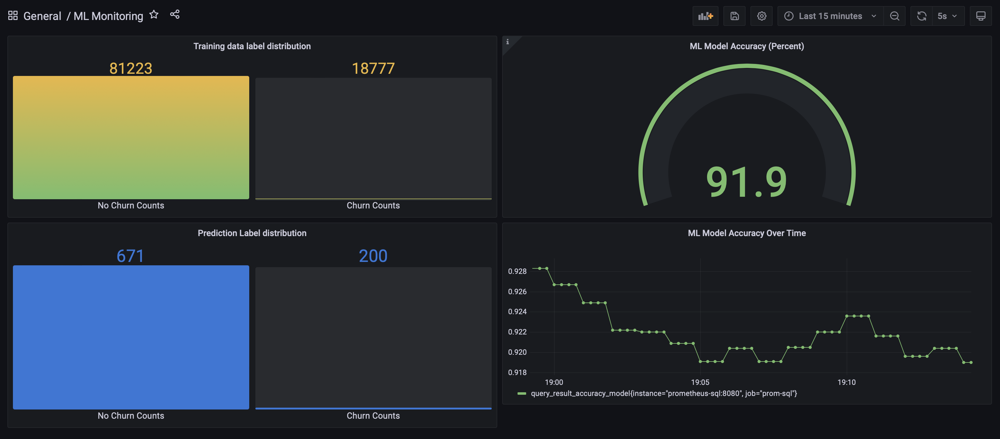
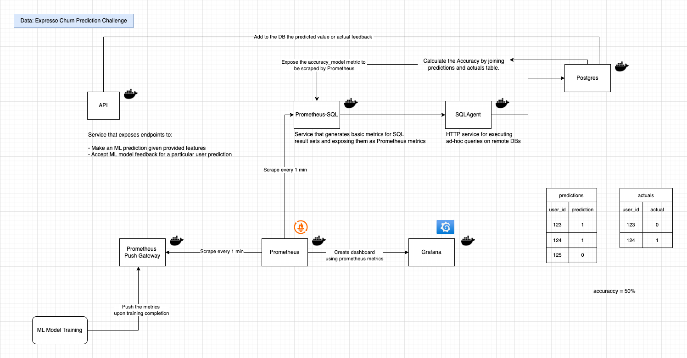
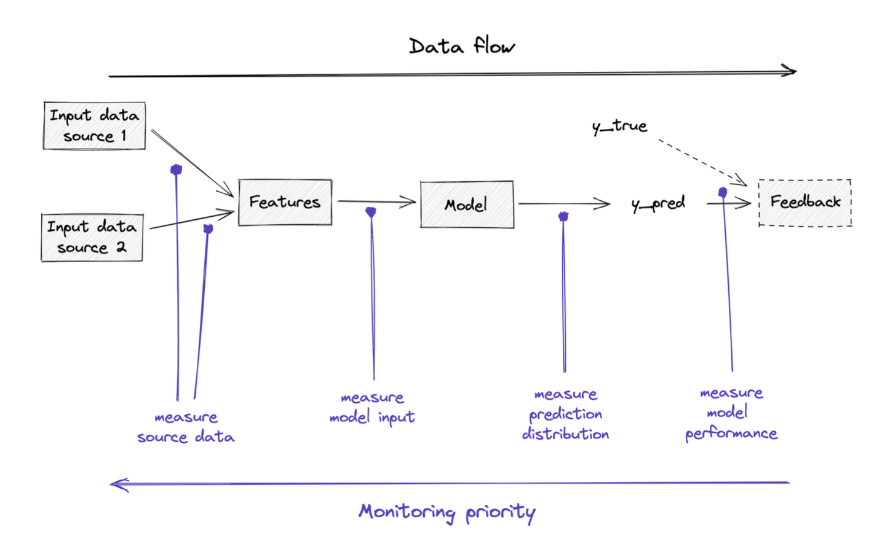

# Data and ML Monitoring with Grafana and Prometheus for Churn Prediction



This is a project that demonstrates the basics of data and ML prediction modnitoring. 

What is monitored:
- Input Data and the distribution of certain important features (Model input)
- ML prediction distribution - measure the distribution of predicted classes.
- ML model perforance using field feedback: we analyse the balance of the predicted classes with the actuals that come from the field with a delay




## Data:

- Expresso Churn Prediction Challenge
https://www.kaggle.com/datasets/hamzaghanmi/expresso-churn-prediction-challenge?select=Train.csv

## Objective
- The objective is to develop a predictive model that determines the likelihood for a customer to churn - to stop purchasing airtime and data from Expresso telecom provider.
Data contains information of about 2 million customers.
Part of the data will be used for training and part will be used for simulating 
inference requests to perform ML monitoring.

## Requirements

- Poetry
- Task https://taskfile.dev/installation/
- Docker
 

## How to run?

```bash
docker compose up
```

Services that will be deployed:

- localhost:3000 - Grafana Dashboard
- localhost:9090 - Prometheus terminal
- localhost:8000 - API

### Download data
```bash
task download-data
``` 

### Train ML model
```bash
task train-model
``` 

### Simulate predictions
We will use the data that was not used in the training, to simulate a real-life scenario of serving.

```bash
task simulate-predictions
``` 

### Simulate field feedback
Record the actual values coming from the field if a customer left a data plan or not

```bash
task simulate-feedback
``` 

## Data Flow Monitoring and Priority



## Prometheus:
- Pull vs Push Model:

By default, Prometheus uses the Pull Model. It scrapes (pulls) metrics from configured targets at regular intervals.
Each target exposes metrics on an HTTP endpoint (usually /metrics). This model is used for long-running services like web-servers.

Push Model: Is used when he application pushes metrics to a central metrics service or gateway. This model is used for short-lived/batch
jobs (ex Model Training) that don't live enough to be scraped. Prometheus then scrapes the metrics from the Push Gateway
as it were a normal scraping target and stores them in its time-series database.

In this project, upon ML model training completion, the class distribution metric (Churn/No Churn) is pushed to the Push Gateway 
so that we have the metrics on how well the data was ballanced during training.